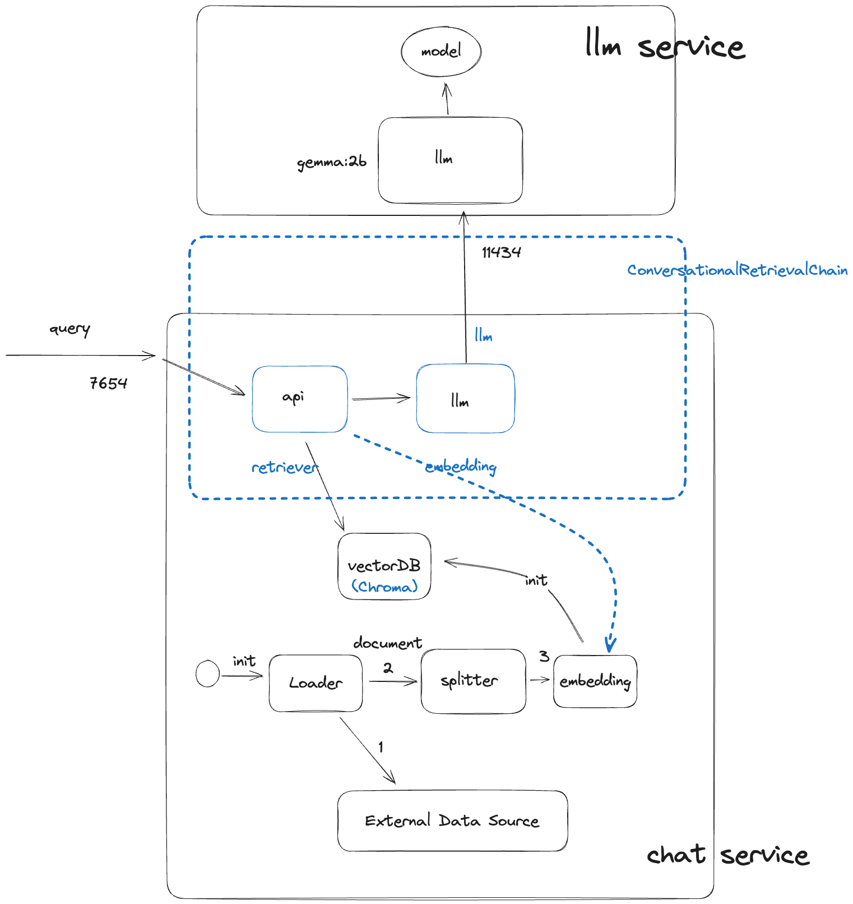

## README

Rag-up set up the local RAG development with following structure.



The code is a clone of [this](https://gitlab.com/rahasak-labs/ollama), with improvement on UX.

- [README](#readme)
- [Step 1: Download model](#step-1-download-model)
  - [Using docker](#using-docker)
  - [Using local install](#using-local-install)
- [Step 2: Start the services](#step-2-start-the-services)
- [Step3: Let's chat](#step3-lets-chat)
- [Appendix](#appendix)
  - [Debug](#debug)
  - [Orignial answer of the LLM before the RAG](#orignial-answer-of-the-llm-before-the-rag)

## Step 1: Download model

This will be one off action. It is to pull the llm model. We will use gemma:2b since [it is the smallest](https://github.com/ollama/ollama?tab=readme-ov-file#model-library).

### Using docker

```bash
➜  ✗ docker run -d -v $(pwd)/data/ollama:/root/.ollama -p 11434:11434 --name ollama-init ollama/ollama
c8399c92c8ad411efa3bf7c540c8a4dcfaa943642689264ab80cdb19e9c2bea3
➜  ✗ docker exec -it ollama-init ollama run gemma:2b
success
>>> Send a message (/? for help)
```

It takes a while to pull the model. Exit the container by typing `/bye`; then
stop and kill the ollama container to avoid conflict with the model service we
will start later.

```bash
docker stop ollama-init
docker rm ollama-init
```

Now, you have pull the model needed. Export the model path.

```bash
export OLLAMA_MODEL_DATA=$(pwd)/data/ollama
```

### Using local install

Optionally, you can also download the model by installing ollama directly to your local host and then
`ollama run gemma:2b`.

The exact location of the model download will depend on your machine, on Mac it
is `~/.ollama`.

Export the model path.

```bash
export OLLAMA_MODEL_DATA=/Users/binchen/.ollama/
```

## Step 2: Start the services

| :exclamation: make sure the `OLLAMA_MODEL_DATA` has been set. see [step 1 above](#step-1-download-model). |
|----------------------------------------------|

```bash
docker composer up
```

It will start the llm model service and the chat service. The chat using langchain to
chain a bunch of steps together. The chat service will also index the external data source
and use it to "argument" the query. That is where the RAG comes from.

## Step3: Let's chat

It the data source, there is an article about how to [build a platform
product](https://www.devicu.com/blog/build-scale-platform-product). Let's ask to
see if the response will include this new information:

```bash
➜ ✗ make chat message="tips for build platform product"
curl -i -XPOST "http://localhost:7654/api/question" \
    --header "Content-Type: application/json" \
    --data '{"question": "tips for build platform product", "user_id": "koala"}'
{
  "answer": "The provided text suggests the following tips for building a platform product:\n\n- **Improve operational excellence:** Focus on reducing toil and enhancing user satisfaction.\n- **Enhance system reliability:** Increase scalability and reduce time to move.\n- **Balance customer needs and platform requirements:** Optimize features and non-functional characteristics.\n- **Utilize time and resources:** Allocate accordingly based on priorities (25% Features Development, 25% Platform Improvement, 25% Platform Operations, 25% Customer Support)."
}
```

This is a great summary of the article and compare with the [unargumented answer](#orignial-answer-of-the-llm-before-the-rag).
It is much relevent and indeed is using new informration to answer the
question. That is exactly what we needed.

## Appendix

### Debug

If your docker composer failed to start due to the port 11434 is already being
used, check who is using it and kill it. If you used the desktop
version of ollama in [step 1](#step-1-download-model), you will have to quit the application from the icon from the
top right of your desktop; otherwise, it will keep restarting automatically.

```bash
lsof -i :11434
```

### Orignial answer of the LLM before the RAG

<details>
  <summary>orignial answer to tips to build platform product</summary>
  
**1. Define Your Target Audience and Market:**

- Identify your ideal customer segments.
- Conduct thorough market research to understand industry trends and unmet needs.
- Analyze competitor offerings to differentiate your platform.

**2. Prototype Early and Often:**

- Build rapid prototypes to validate assumptions.
- Use iterative development to gather feedback and make improvements.
- Leverage agile methodologies to ensure iterative progress.

**3. Focus on User Experience:**

- Prioritize user needs and pain points.
- Design intuitive and user-friendly interfaces.
- Provide comprehensive documentation and support.

**4. Implement Effective Marketing and Sales Strategies:**

</details>
